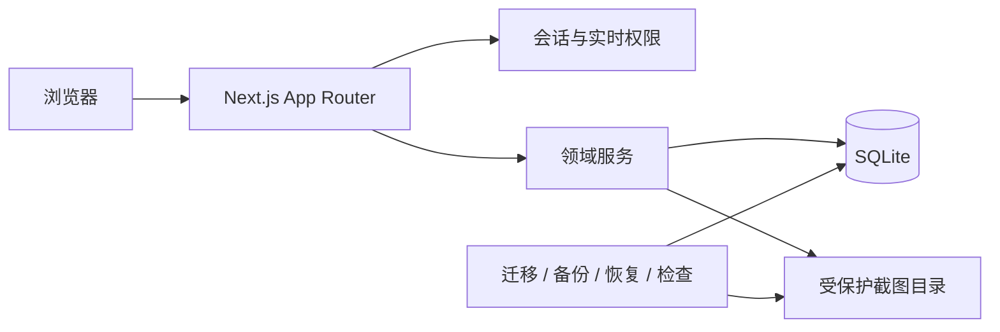
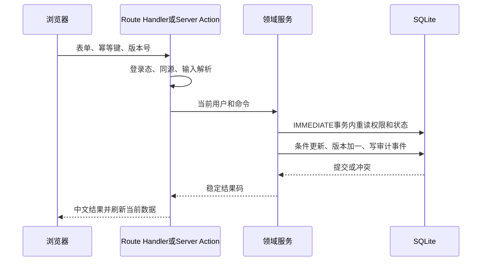

# 系统架构

## 总览

RequestManager 是单进程全栈应用。Next.js App Router 提供服务端页面、Server Actions 和 Route Handlers；领域服务负责授权、状态机、事务和审计；Drizzle ORM 访问本地 SQLite；截图存放在 `public` 之外。

## 模块边界

| 模块 | 职责 |
| --- | --- |
| `src/auth` | scrypt 密码、会话、登录限速、实时账号守卫 |
| `src/db` | Schema、连接参数、迁移 journal、运行时单例 |
| `src/features/accounts` | 账号、密码重置、启停、项目成员关系 |
| `src/features/projects` | 项目管理和项目访问检查 |
| `src/features/requests` | 查询、排序、编辑资格、状态机、操作历史 |
| `src/features/communication` | 公开备注、私人笔记、简单澄清 |
| `src/features/attachments` | 文件签名验证、暂存、提交、鉴权下载 |
| `src/ops` | 路径安全、进程锁、备份恢复、完整性检查 |
| `src/app` | 页面组合、路由守卫和受控 HTTP 接口 |

页面不直接写数据库。写操作必须把当前会话用户和输入传给领域服务；领域服务在事务内重新读取实时账号、项目和需求状态，而不是信任浏览器传入的角色或项目。

## 写入流程

新建需求、公开备注和澄清消息用用户加幂等键的唯一约束防止重复。需求编辑和状态操作使用 `id + version` 条件更新，冲突时要求刷新。

## 截图流程

浏览器选择、拖放或粘贴图片后，仅显示本地预览。服务端限制请求体，读取单文件上限加一个字节，按文件魔数确认 PNG/JPEG/WebP，计算 SHA-256，并写入随机临时文件。数据库事务成功后文件原子移动到随机存储名对应的前缀目录；下载只能通过 `/api/attachments/[attachmentId]`，每次重新验证会话和项目权限。

## SQLite 运行模型

连接启用 `foreign_keys=ON`、WAL 和 5 秒 `busy_timeout`。生产启动不隐式迁移。应用运行时持有数据库进程锁，恢复命令使用同一锁排除并发启动。此锁只约束 RequestManager 进程，不能阻止外部 SQLite 工具，因此运维仍需遵守单写入者和停服恢复规则。
