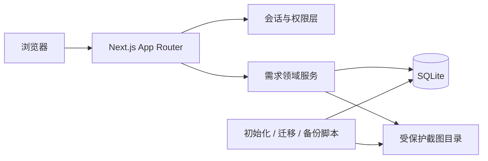

# 用户需求管理工具设计规格

**文档状态：** 已实施并验证  
**日期：** 2026-07-10  
**产品名称：** RequestManager

## 1. 目标

RequestManager 是面向客户与开发团队的小型需求协作工具。它用尽量少的流程完成四件事：客户提交清晰的需求，开发者安排处理，双方完成必要的澄清，所有参与者随时知道需求当前处于什么状态。

产品的首要原则是简单易用。系统不引入审批流、工单流转人、子任务、工时、通知中心或复杂的澄清状态。每项能力都必须服务于“提交、查看、处理、澄清”这条主路径。

## 2. 成功标准

1. 客户能在所属项目中用一个表单提交文字需求，可粘贴多张截图，明确选择需求类型与优先级。
2. 客户能看到所属项目的全部需求及提交人，但只能编辑自己提交且仍为“正常 + 未排期”的需求。
3. 开发者能查看所有项目需求，改变进度，添加客户可见的备注，维护仅自己可见的笔记，并向客户提问。
4. 待客户答复的需求在客户完整结果集中优先排序、标红，并同时显示文字标识；任一项目客户回复后提醒立即消失。
5. 项目、需求、截图、私人笔记的权限均由服务端验证，不能通过猜测地址或篡改表单越权。
6. 应用可在一台机器上用一个 Node.js 进程和本地 SQLite 稳定运行，数据、附件、初始化、迁移、备份和恢复都有明确操作方式。
7. 核心领域规则、真实 SQLite 集成、关键浏览器流程和响应式界面全部通过自动化或明确的人工验收。

## 3. 范围

### 3.1 本期包含

- 用户名和密码登录，两种角色：客户、开发者。
- 开发者管理项目、账号、账号启停、用户名、密码重置和客户的项目分配。
- 客户修改本人密码，不能修改用户名。
- 客户在所属项目提交、浏览和按规则编辑需求。
- 需求类型、优先级、三种进度状态和三种记录状态。
- 截图选择、拖放、粘贴、预览、移除和受控访问。
- 开发者公开备注、开发者个人私密笔记、简单澄清对话。
- 搜索、筛选、稳定排序、分页、操作历史。
- 本地初始化、数据库迁移、备份、恢复和运行手册。

### 3.2 明确不包含

- 客户自助注册、找回密码、邮件或短信通知。
- 第三种管理员角色、复杂组织层级或逐项自定义权限。
- 审批流、处理人、工时、截止日期、迭代或看板。
- 富文本、Markdown 渲染、附件类型扩展到普通文件或视频。
- 需求删除。错误或过期记录通过暂停、归档处理。
- 云对象存储、外部数据库、水平多实例部署。

## 4. 角色与权限

所有开发者首版同权，并承担系统管理职责。授权检查必须位于服务端领域服务中；隐藏按钮只是界面表现，不能作为权限控制。

| 能力 | 客户 | 开发者 |
| --- | --- | --- |
| 登录、退出、修改本人密码 | 可以 | 可以 |
| 修改本人用户名或角色 | 不可以 | 不可以直接修改本人角色 |
| 创建账号、修改用户名、重置密码、启停账号 | 不可以 | 可以 |
| 创建、编辑、停用项目 | 不可以 | 可以 |
| 分配客户到项目 | 不可以 | 可以 |
| 查看需求 | 所属项目全部需求 | 全部需求 |
| 新建需求 | 仅所属且启用的项目 | 不提供 |
| 编辑需求主体 | 仅本人提交且“正常 + 未排期” | 不修改客户原始主体 |
| 修改进度状态 | 不可以 | 可以 |
| 暂停需求 | 仅本人提交且“正常 + 已排期” | 可以暂停任意“正常 + 已排期”需求 |
| 恢复暂停、归档、恢复归档 | 不可以 | 可以 |
| 查看公开备注 | 有需求查看权时可以 | 可以 |
| 添加公开备注 | 不可以 | 可以 |
| 查看、编辑私人笔记 | 不可以 | 仅能查看、编辑自己的笔记 |
| 发起澄清问题 | 不可以 | 可以 |
| 回复澄清 | 所属项目任一客户可以 | 开发者通过继续提问推进 |
| 查看操作历史 | 只看公开事件 | 看全部非私人内容事件 |

额外保护规则：

- 不允许停用当前登录的开发者。
- 不允许停用系统中最后一个启用的开发者。
- 账号或项目只有启用/停用，没有物理删除。
- 客户解除项目分配后，现有会话下一次访问立即失去该项目、需求及截图权限；历史提交人名称仍保留。
- 项目停用后不再接受新需求，已有需求对仍被分配的客户保持只读可查；开发者可继续查看并可重新启用项目。

## 5. 领域模型

### 5.1 用户与项目

- `User`：用户名、显示名、密码哈希、角色、启用状态、是否必须改密、创建和更新时间。
- `Session`：随机会话令牌的哈希、用户、过期时间、创建和最后使用时间。
- `Project`：项目编号、名称、说明、启用状态、创建和更新时间。
- `ProjectMembership`：客户与项目的多对多关系。开发者不需要项目分配即可查看全部项目。

用户名去除首尾空格后保存为小写规范值，全局大小写不敏感唯一；显示名保留用户需要的大小写与中文。用户名允许 3-32 个 ASCII 字母、数字、点、下划线和连字符。开发者修改用户名不会改变用户主键或历史记录归属。

### 5.2 需求

`Request` 包含：

- 全局稳定编号，例如 `REQ-000001`。
- 所属项目、提交人、需求正文。
- 类型：`BUG`、`CHANGE`、`NEW_FEATURE`，界面显示“Bug”“功能变更”“新增功能”。
- 优先级：`URGENT`、`IMPORTANT`、`NORMAL`，界面显示“加急”“重要”“普通”，默认普通。
- 进度状态：`UNSCHEDULED`、`SCHEDULED`、`COMPLETED`，界面显示“未排期”“已排期”“完成”。
- 记录状态：`ACTIVE`、`PAUSED`、`ARCHIVED`，界面显示“正常”“已暂停”“已归档”。
- 是否待客户回复、乐观锁版本、创建和更新时间。

正文是唯一必填文本字段，去除首尾空白后长度为 10-10,000 个字符。列表摘要自动取正文第一行；第一行为空或过长时取规范化正文的前 60 个字符，不额外要求客户填写标题。

### 5.3 沟通与附件

- `PublicRemark`：开发者添加的备注，客户可以查看；记录作者和时间，采用追加记录，不互相覆盖，不触发待回复提醒。
- `PrivateNote`：每位开发者在每条需求上最多一份个人笔记，可反复编辑；读取查询从数据层按当前开发者 ID 限定，绝不把他人的笔记发送到页面载荷。
- `ClarificationMessage`：不可删除的澄清消息，记录作者、角色、正文和时间。开发者消息视为问题，客户消息视为回复。
- `Attachment`：随机存储名、原始文件名、MIME、字节数、校验摘要和需求关联。文件位于受保护的数据目录，不放入 `public`。
- `RequestEvent`：状态、主体、附件、备注和账号关联操作的审计事件。私人笔记正文不进入通用审计载荷。

## 6. 状态规则

### 6.1 创建与编辑

- 新需求固定创建为“未排期 + 正常”，项目和提交人由服务端会话确定。
- 客户只能编辑本人提交且当前仍为“未排期 + 正常”的需求，可改正文、类型、优先级和截图。
- 同项目其他客户只能查看和回复澄清，不能编辑原需求。
- 开发者不直接修改客户原始正文、类型、优先级或截图，避免改变客户原意。
- 编辑提交携带版本号。若客户打开编辑页后需求被排期、归档或被其他操作更新，服务端拒绝旧提交并提示刷新，不覆盖新状态。

### 6.2 进度状态

- 仅开发者可改变进度状态。
- 正常需求可在“未排期、已排期、完成”之间切换，以支持纠错和重新打开；每次变化保留事件记录。
- 已暂停或已归档时不能改变进度，必须先由开发者恢复为正常。

### 6.3 记录状态

- “正常”是默认状态。
- 客户只能把本人提交的“正常 + 已排期”需求暂停。
- 开发者可以暂停任意“正常 + 已排期”需求，并恢复已暂停需求；恢复后仍为“已排期 + 正常”。
- 暂停需求保留在默认列表但只读，不显示待回复提醒。客户可直接新建替代需求，不强制建立关联。
- 只有开发者可以归档正常或暂停的需求。归档后默认列表隐藏，可通过“已归档”筛选只读查看。
- 开发者恢复归档后统一变为“正常”，原进度状态保留；此前的暂停标记不恢复。
- 已暂停和已归档需求不能编辑主体、增删附件、改变进度、添加备注、编辑私人笔记、提问或回复。
- 不允许“未排期 + 已暂停”或“完成 + 已暂停”等非法组合。

## 7. 简单澄清规则

澄清不引入第四种进度状态，也不需要“解决”按钮。

1. 开发者在正常需求上发布问题后，事务内写入消息并将 `needsCustomerReply` 设为真。
2. 该需求在所有仍属于项目的客户列表中全局置顶、标红，并显示“待您回复”文字和图标。
3. 任一所属项目客户回复后，事务内写入回复并立即将 `needsCustomerReply` 设为假。
4. 开发者再次提问时重新设为真；连续多个开发者问题仍只是一个待回复提醒。
5. 浏览需求、修改公开备注或编辑原需求都不能清除提醒，只有成功提交澄清回复可以清除。
6. 暂停或归档时提醒被抑制但消息保留；恢复为正常后，如果最后一条澄清消息来自开发者，则重新显示提醒。
7. 澄清消息不可编辑或删除；需要修正时发送新消息。
8. 客户回复输入只在需求正常且 `needsCustomerReply` 为真时可用；并发情况下第一条成功回复清除提醒，稍后的旧页面提交返回“该问题已被回复”。

## 8. 截图规则

- 新建和可编辑需求支持点击选择、拖放以及从系统剪贴板粘贴图片。
- 正文输入框内粘贴纯文本只写入文本；含图片的剪贴板事件才创建截图预览。
- 支持 PNG、JPEG、WebP；拒绝 SVG、GIF 和仅伪造扩展名或 MIME 的文件。
- 每张最大 10 MiB，每条需求最多 8 张，全部附件合计最大 30 MiB。
- 客户端先做即时提示，服务端再按文件签名字节、大小、数量和总量重新验证。
- 文件使用随机生成的存储名，并记录 SHA-256；原始文件名仅作为经过转义的展示信息。
- 截图经鉴权路由读取。客户必须仍属于需求项目；开发者必须是启用账号。退出、停用或解除项目分配后原 URL 不再可访问。
- 新建或编辑时先写入临时目录，经验证后与数据库操作协调提交；失败时清理临时文件，不能留下可访问的孤儿附件。
- 删除附件时先完成数据库事务，再删除物理文件；清理失败进入运维日志，并由附件一致性检查命令处理。

## 9. 页面与交互

### 9.1 信息架构

- `/login`：用户名、密码、统一错误提示。
- `/requests`：登录后的主界面，角色决定可见操作与默认排序。
- `/requests/new`：客户新建需求。
- `/requests/[requestId]`：需求详情、截图、公开备注、澄清、个人笔记和公开历史。
- `/requests/[requestId]/edit`：满足条件时编辑本人需求。
- `/account/password`：本人修改密码；被重置密码后强制进入此页。
- `/manage/projects`：开发者管理项目。
- `/manage/users`：开发者管理账号、密码重置和客户项目分配。

### 9.2 列表

桌面端使用高密度表格，移动端使用同一信息层级的紧凑列表，不使用装饰性大卡片。每行稳定显示需求编号、正文摘要、项目、提交人、类型、优先级、进度、记录状态、最后更新时间及待回复标识。

客户默认排序在完整查询结果上执行：

1. 正常且待客户回复的需求。
2. 其他正常需求。
3. 已暂停需求。
4. 同组内按最后更新时间倒序，再按需求 ID 倒序保证稳定分页。

开发者默认按最后更新时间倒序。双方都可搜索编号和正文，并按项目、类型、优先级、进度、记录状态筛选；客户只能选择所属项目。每页 25 条。归档默认隐藏，但筛选入口始终可发现。

### 9.3 详情与表单

- 详情页先展示核心正文和状态，再展示截图、公开备注、澄清、个人笔记和事件历史。
- 开发者的公开备注、澄清问题和私人笔记使用三个明确标签，不混用输入框。
- 私人笔记区只加载当前开发者自己的数据。
- 所有状态动作使用清晰的菜单或选择控件；暂停、归档等有影响的操作要求简短确认。
- 提交按钮在请求进行中禁用，并用幂等键防止双击产生重复需求或消息。
- 表单验证失败、会话过期或并发冲突时尽量保留用户已输入内容，并给出可执行的中文错误提示。
- 红色不是唯一信号；待回复同时有图标、文字和可访问标签。
- 所有表单有可见标签、键盘焦点、错误关联和足够对比度。移动端无法粘贴时仍可使用系统文件选择器。

## 10. 技术架构

### 10.1 总体结构

采用单体全栈架构：Next.js App Router 负责服务端渲染与页面，Server Actions/Route Handlers 负责写操作和受控文件响应，领域服务统一执行业务规则，Drizzle ORM 管理 SQLite 查询与显式迁移。

模块边界：

- `src/auth`：密码、会话、当前用户和角色守卫。
- `src/db`：连接配置、Schema、迁移和测试数据库。
- `src/features/accounts`：账号与项目分配规则。
- `src/features/projects`：项目管理和项目授权。
- `src/features/requests`：需求查询、编辑资格、状态转换和排序。
- `src/features/communication`：公开备注、私人笔记和澄清规则。
- `src/features/attachments`：验证、暂存、提交、鉴权读取和一致性检查。
- `src/components`：无业务权限判断的可复用界面组件。

页面只能调用领域服务，不直接拼接数据库写入。领域服务同时接收当前用户身份和输入数据，并在事务内完成授权复查、状态验证、写入和审计。

### 10.2 SQLite 运行约束

- 单个 Node.js 进程连接一个本地 SQLite 文件，不支持无状态 Serverless 或多个应用实例共享该文件。
- 启用 `foreign_keys=ON`、WAL 日志和合理的 `busy_timeout`。
- 迁移由独立命令在启动新版本前执行；生产启动不隐式修改 Schema。
- 写事务保持短小。状态变化、澄清标志与对应消息必须原子提交。
- 所有时间以 UTC 存储，界面按浏览器本地时区显示；验收默认使用 Asia/Shanghai。
- 需求使用整数主键和唯一展示编号；分页使用稳定排序，避免重复或遗漏。

### 10.3 并发与幂等

- 需求包含整数 `version`。编辑、状态、暂停和归档操作使用“ID + 当前版本”更新，受影响行数为零时返回并发冲突。
- 新建需求、公开备注、澄清消息使用一次性幂等键；同一用户重复提交同一键只产生一条记录。
- 数据库唯一约束作为最后防线，不依赖客户端按钮禁用。
- 两个开发者同时操作时，以成功提交的事务顺序形成确定历史；失败的一方刷新后重试。

## 11. 安全设计

- 密码使用 Node.js `scrypt`、每个密码独立随机盐和常量时间比较，不存储或记录明文密码。
- 登录成功生成至少 32 字节随机令牌；数据库只保存 SHA-256 后的令牌。Cookie 使用 `HttpOnly`、`SameSite=Lax`，生产环境启用 `Secure`。
- 会话默认有效 7 天。退出、账号停用、开发者重置密码或本人修改密码时撤销该用户全部旧会话；改密成功后要求重新登录。
- 开发者新建或重置账号密码后设置“必须修改密码”，用户首次登录只能访问改密和退出。
- 登录错误统一显示“用户名或密码错误”，不泄露账号存在性。连续失败按用户名与来源地址进行短时限速。
- 所有写操作校验登录态、角色、项目归属、资源当前状态、版本和输入枚举，并验证同源 `Origin`。
- 所有用户文本以纯文本转义显示，不执行 HTML；审计和错误日志不记录密码、会话令牌、私人笔记正文或截图内容。
- 页面、Server Action、Route Handler 和附件响应使用同一授权服务，重点防止 IDOR。

## 12. 错误处理

- 领域服务返回稳定错误码：未登录、无权限、记录不存在、输入无效、状态冲突、版本冲突、附件无效和系统暂时不可用。
- 对用户展示简洁中文信息；数据库路径、SQL、堆栈、令牌和内部 ID 不进入响应。
- 未授权资源对外统一返回不存在，减少资源枚举。
- 数据库忙或短暂写冲突只对安全的幂等操作做有限重试，其他情况提示刷新重试。
- 上传任何一张图片失败时不提交本次需求变更，并明确指出失败文件；已填写正文保持在浏览器表单中。

## 13. 运维与数据保护

- 默认数据文件：`data/request-manager.db`；默认截图目录：`data/uploads`；临时目录：`data/tmp`。这些目录不提交 Git。
- 配置通过环境变量提供数据库路径、附件路径、应用来源地址和安全 Cookie 开关，并附带 `.env.example`。
- 首次部署顺序：安装依赖、执行迁移、运行首个开发者初始化命令、启动应用。
- 初始化命令只在没有启用开发者时创建首个账号；重复执行不能覆盖已有密码。
- 备份命令先执行 WAL checkpoint，再生成 SQLite 一致性快照，并把截图目录与清单写入同一个带时间戳的备份目录。
- 恢复必须在应用停止时进行，先验证备份清单和文件摘要，再原子替换数据库与截图目录。
- 提供附件一致性检查命令；默认只报告，修复模式仅显式清理孤儿文件，缺失文件和数据库记录不自动删除。
- 运维日志使用结构化单行输出，记录事件与稳定错误码，不记录密码、令牌、私人笔记或截图内容。

## 14. 测试与发布门禁

### 14.1 单元测试

- 角色权限矩阵、编辑资格、进度与记录状态组合。
- 澄清待回复计算、暂停/归档抑制和恢复规则。
- 客户列表全局排序、稳定分页和筛选。
- 用户名、密码、需求正文、枚举和附件验证。

### 14.2 集成测试

使用真实临时 SQLite 和临时文件目录，不把权限查询或事务 mock 掉：

- 登录、会话撤销、强制改密、最后一个开发者保护。
- 多项目与撤销成员资格后的读取、写入、详情和截图隔离。
- 旧编辑页遇到排期或归档时拒绝覆盖。
- 状态、暂停、恢复、归档、恢复归档及审计事件。
- 公开备注可见性和两个开发者之间的私人笔记隔离，包括服务端返回载荷。
- 澄清消息与待回复标志的事务一致性。
- 上传验证、暂存清理、附件受控读取和一致性检查。
- 幂等键与快速双提交。

### 14.3 浏览器端到端测试

1. 客户登录，粘贴截图创建需求并在列表看到“未排期”。
2. 开发者登录，排期、添加公开备注、填写私人笔记并提问。
3. 客户看到全局置顶且标红的“待您回复”，查看公开备注但看不到私人笔记，回复后提示消失。
4. 开发者再次提问，提示重新出现；客户暂停需求，开发者恢复并归档，客户在归档筛选中只读查看。
5. 第二个客户能查看同项目需求并回复，但不能编辑；未分配项目客户无法通过详情、动作或截图 URL 访问。
6. 第二个开发者不能看到第一个开发者的私人笔记。
7. 桌面与移动视口检查无重叠、截断或不可操作控件，键盘可完成核心流程。

自动化剪贴板测试使用浏览器 `DataTransfer` 构造真实图片项；发布前另做一次操作系统剪贴板人工烟测，并将两类证据分开记录。

### 14.4 发布条件

- 类型检查、Lint、单元测试、集成测试、E2E 和生产构建全部通过。
- 从空数据库完成迁移和首个开发者初始化。
- 实际执行一次备份与恢复演练，恢复后需求和截图可读。
- 使用当前运行进程完成客户与开发者浏览器验收，而不是只验证源码或测试替身。
- README、规格、架构、数据模型、权限、测试和运维文档与最终代码一致，无占位符或未说明的功能。

## 15. 需求追踪标识

实施文档和验收测试使用以下标识保持对齐：

- `AUTH`：登录、会话、改密、账号启停。
- `PROJ`：项目管理与成员隔离。
- `REQ`：需求创建、查看、编辑、筛选和分页。
- `STATE`：进度、暂停和归档。
- `COMM`：公开备注、私人笔记和澄清。
- `ATT`：截图上传、存储和访问。
- `OPS`：迁移、初始化、备份、恢复和一致性检查。
- `UX`：响应式、可访问性和错误恢复。

## 16. 已确定决策

1. 采用 Next.js App Router + Drizzle ORM + 本地 SQLite 的全栈单体方案。
2. 只有客户和开发者两种角色；开发者同时负责管理。
3. 客户可看到所属项目全部需求，任一同项目客户均可回复澄清。
4. 公开“备注”对客户可见；私人“笔记”只对笔记作者本人可见。
5. 澄清由最后一次开发者提问与客户回复驱动标红，不增加额外流程状态。
6. 进度状态与记录状态分离；暂停和归档不扩充原有三种进度状态。
7. 需求不物理删除；客户原始内容不由开发者修改。
8. 以简单可靠为优先，不加入本期范围外的项目管理功能。

## 17. 实施验证记录

2026-07-10 已完成：188 项 Vitest 单元、组件和真实 SQLite 集成测试，10 项 Playwright 双角色浏览器验收，TypeScript、ESLint、Next.js 生产构建和 `npm audit`。另在隔离数据上完成数据库与截图备份恢复、孤儿/缺失附件检查和仅孤儿修复，并在当前生产构建上完成桌面、移动视口与 macOS 系统剪贴板真实图片粘贴提交。具体命令和证据边界见 `docs/testing.md` 与 `docs/operations.md`。
